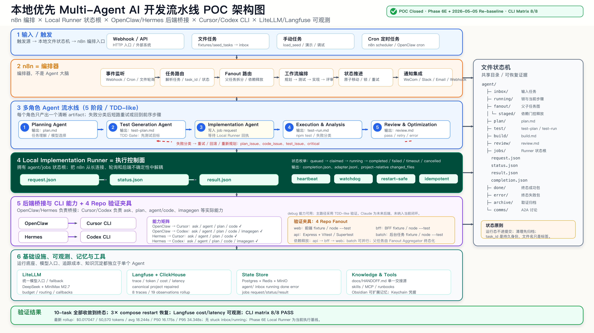

# 从零搭建一个本地优先 Multi-Agent AI 开发流水线 POC

用 n8n、Local Runner、OpenClaw / Hermes、Cursor / Codex CLI、LiteLLM 和 Langfuse，把一个想法跑成可验证的工程闭环。

最终架构不是概念图，而是已经跑过验证的 POC 结果。

## 为什么要做这个 POC

过去一年，AI 写代码的体验进步很快。Cursor、Codex、Claude Code、各种本地 CLI 和 Agent 框架，都在把“让模型帮我改代码”这件事变得越来越顺手。

但我真正关心的问题不是“一个 Agent 能不能偶尔写出一段好代码”，而是另一个更工程化的问题：

**如果我把一个软件开发任务交给一组 Agent，它们能不能像一个小型工程团队一样，被触发、拆解、实现、测试、评审、失败重试，并且留下可观察、可恢复、可追踪的证据？**

这就是这个 POC 的起点。

我不想一开始就押注某一个昂贵模型，也不想一上来就引入一个很重的 multi-agent 框架。我的目标更朴素：先在本地跑起来；把任务状态放在自己能控制的地方；让 n8n 只做编排；把模型成本、延迟和调用链路记录下来；最后通过测试、重启、失败分类来证明这个系统不是演示动画。

图 1：问题不是让一个 Agent 变得更神，而是把软件开发拆成可编排、可验证、可恢复的多个角色。

## 最初的设计：n8n 编排，文件系统做状态机

这个 POC 的第一条原则是：**n8n 是编排器，不是 Agent 大脑。**

n8n 很适合做触发、路由、定时、通知、队列和状态推进。它也很适合把一个流程可视化，让人能看到任务大概走到哪里了。但复杂的 Agent 推理、代码执行、后端 CLI 状态追踪，不适合全部塞进 n8n 的节点里。

所以我一开始就把系统拆成几层：

- n8n：触发、路由、编排、状态推进
- 文件系统：任务状态和中间产物
- LiteLLM：统一模型入口、fallback 和成本控制
- Langfuse：trace、token、cost、latency
- Cursor / Codex：真实代码执行能力
- OpenClaw / Hermes：本地工具、CLI 和 Agent 后端桥接

任务不是只存在于某个内存队列里，而是落在 `agent/` 目录下，形成一个文件状态机。

这个设计一开始看起来有点“土”。但后来证明，恰恰是这种本地 artifact-first 的设计，让系统在失败、重启和状态不确定时，有了可恢复的抓手。

## 从零到 Phase 6E：真正的转折在状态源

Phase 0 先把本地基础设施跑起来：Docker Compose 里包括 n8n、Postgres、Redis、ClickHouse、MinIO、LiteLLM、Langfuse 等服务。

Phase 1 到 Phase 4 搭出了最初的 TDD-like 多 Agent 流水线：Planning、Test Generation、Implementation、Execution & Analysis、Review & Optimization。

Phase 5 做了第一次 10-task 批量验证。结果很有意思：任务都能收敛到终态，没有丢失，也没有重复执行；但是因为当时 OpenClaw 后端接入还不稳定，实际实现成功率并不好。

这个阶段给我的结论不是“失败了”，而是更具体：

**编排环节是稳定的，真正的问题在实现后端和执行状态源。**

Phase 6A 到 Phase 6C 开始接入 OpenClaw / Cursor，做单 repo 到多 repo fanout 的验证。系统开始真的能改代码、跑测试、聚合多 repo 子任务。

Phase 6D 暴露了一个关键问题：OpenClaw 能触发 Cursor 做事，但没有一个足够稳定、可依赖的状态 / 结果 RPC。如果 n8n 一直等后端长连接或后端状态，整个系统会被后端不确定性拖住。

所以 Phase 6E 做了架构转向：引入 Local Runner。

Local Runner 不再让 n8n 直接追后端状态，而是让 n8n 写入 job request，然后轮询本地 `status.json` 和 `result.json`。Local Runner 负责跟 OpenClaw、Hermes、Cursor CLI、Codex CLI 等后端打交道。

这一步之后，状态源从不稳定后端迁回本地。

图 2：Phase 6E 的关键不是又接了一个模型，而是把执行状态源收回到本地。

## TDD-like 五阶段 Agent 流水线

这个 POC 没有把“写代码”交给一个万能 Agent，而是把软件开发拆成五个角色：

- Planning Agent：读任务，生成 `plan.md`
- Test Generation Agent：生成 `test-plan.md`，先定义验证目标
- Implementation Agent：读取 plan 和 test-plan，提交实现 job
- Execution & Analysis Agent：运行测试，解析失败
- Review & Optimization Agent：做评审，决定 pass、retry、rollback 或重新规划

这个结构的关键不是“多了几个 Agent 名字”，而是引入了约束。

实现之前必须先有测试目标。运行失败必须分类。评审结果必须能反馈到前序阶段。每一步都有 artifact，而不是只在聊天上下文里留下印象。

图 3：TDD-like 的重点是先定义验证目标，再让实现 Agent 围绕测试目标收敛。

## Local Runner：把状态拿回本地

Phase 6E 之后，Implementation Agent 的工作方式变成：

1. 写入 `agent/jobs/{task_id}.request.json`
2. Local Runner 认领任务
3. Local Runner 调用后端 adapter
4. Local Runner 持续写 `status.json`
5. 后端完成后写 `result.json`
6. n8n 读取结果并进入后续 test / review

这听起来只是多了一层 runner，但它解决了几个实际问题。

n8n 不再依赖后端长连接。OpenClaw、Hermes、Cursor CLI、Codex CLI 都可以变成 adapter，而不是变成状态源。心跳和 watchdog 可以本地化。只要 `request.json`、`status.json`、`result.json` 在，系统就能判断任务应该继续、重试、失败还是完成。

这就是我后来对这个 POC 的一个核心判断：

**Multi-Agent 工程化的关键，不是把 Agent 画得更复杂，而是把状态、边界和证据放在可控的位置。**

图 4：Local Runner 让 n8n 不再依赖后端长连接状态，而是轮询本地可恢复的 job artifacts。

## 为什么这和现在 multi-agent 潮流契合

做完这个 POC 后再回头看，会发现它和很多论文、工程文章的方向是同向的。

ChatDev 和 MetaGPT 都强调角色分工、SOP 和文档化产物。我的 POC 里，Planning、Test Generation、Implementation、Execution、Review 其实就是一个轻量化的软件工程 SOP。

SWE-agent 强调 Agent 需要合适的 computer interface。这个 POC 里的 OpenClaw、Hermes、Cursor CLI、Codex CLI，本质上都是在解决 Agent 如何稳定操作本地工程环境的问题。

TDFlow、Agentic Testing 一类工作强调测试优先和执行反馈。这个 POC 的 TDD-like gate 就是把实现 Agent 约束在测试目标之后，而不是让它自由发挥。

LangGraph 和 n8n 的 multi-agent 文章强调图、编排、状态流、supervisor 模式。我的 POC 没有直接使用 LangGraph，但用 n8n + 文件状态机 + Local Runner 搭出了类似的工程结构。

Anthropic 的 multi-agent research system 复盘也反复强调一个事实：多 Agent 不只是多个模型互相聊天，而是需要状态、checkpoint、评估和可观测。

Langfuse 则对应另一个生产化问题：如果看不到 trace、token、cost、latency，就不知道系统到底发生了什么，也无法判断一次 POC 是否值得继续投入。

图 5：这个 POC 不是孤立拼工具，而是和角色分工、SOP、工具接口、测试优先和可观测这些研究 / 工程主线同向。

## 验证结果：这个 POC 到底证明了什么

最终，我不想用“感觉挺好”作为结论，所以给这个 POC 留了几类证据。

- 10-task re-baseline batch 全部收敛到终态，没有 stuck 在 `inbox/` 或 `running/`
- 三次 Docker Compose restart 之后，系统可以恢复
- Langfuse / ClickHouse 里能看到 cost、latency、token 的 rollup
- OpenClaw / Hermes 调 Cursor / Codex 的 CLI matrix 达到 8/8 PASS
- 项目已经整理成 GitHub 仓库，包含 docs、runner、workflow、scripts、target fixture repos、最终架构图和演示 PPT

最新一次 rollup 的数字是：

- 总成本：`$0.017047`
- 总 token：`50,570`
- 平均 observation latency：`18.244s`
- P50：`16.175s`
- P95：`34.348s`

这些数字不代表系统已经生产级，但它们代表一件事：

**这个 POC 已经从“想法”走到了“可验证的工程基线”。**

图 6：POC 最后验证的是工程闭环：终态收敛、重启恢复、可观测和 CLI 能力矩阵。

## 这套东西还不是生产级

我不想把这个 POC 写成一个过度包装的“已经搞定一切”的故事。

它还不是生产级系统。

n8n workflow 的可维护性还可以继续优化。Local Runner 现在更像一个 POC 级执行控制面，还没有被正式服务化。Hermes 目前更多是 contract / stub 级验证。Codex、Claude 等后端还可以继续做更严谨的 A/B benchmark。任务质量、评审标准、失败分类和成本策略，也都还有继续打磨空间。

但这些并不削弱 POC 的价值。

因为这个 POC 证明的不是“某个模型最强”，也不是“某个框架最好”，而是：

**一个通用软件开发任务，可以被拆成多角色 Agent 流水线，通过本地 artifact 控制状态，通过 CLI 后端执行，通过测试和评审闭环收敛，通过 Langfuse 观察成本和延迟。**

## 我的结论

如果只看表面，这个项目像是把 n8n、Cursor、Codex、OpenClaw、Hermes、LiteLLM、Langfuse 拼在一起。

但真正的收获不是工具拼装，而是几个工程判断。

第一，Agent 不应该直接等于流程。流程要有状态机、artifact、重试和终态。

第二，n8n 适合做编排器，不适合承载所有 Agent 智能。

第三，测试优先不是传统 TDD 的复古，而是约束 Agent 幻觉的一种工程方法。

第四，本地优先并不落后。对于需要访问 IDE、CLI、文件系统和本地凭证的开发任务，本地状态根反而更可靠。

第五，可观测不是锦上添花。没有 cost、latency、trace，就没有办法管理 multi-agent 系统。

这也是我准备把这个 POC 停在 Phase 6E 的原因：它已经足够证明方向；下一步应该不是继续堆功能，而是围绕生产化、A/B 评估和长期运行来做更精细的工程。

## 参考资料

Mattermost: Automating our backlog with Cursor Automations, n8n, and Mattermost  
https://mattermost.com/blog/automating-our-backlog-with-cursor-automations-n8n-and-mattermost/

n8n: Multi-agent systems  
https://blog.n8n.io/multi-agent-systems/

Anthropic: How we built our multi-agent research system  
https://www.anthropic.com/engineering/multi-agent-research-system

LangGraph: Multi-Agent Workflows  
https://www.langchain.com/blog/langgraph-multi-agent-workflows

Langfuse: AI Agent Observability with Langfuse  
https://langfuse.com/blog/2024-07-ai-agent-observability-with-langfuse

Langfuse n8n integration  
https://langfuse.com/integrations/no-code/n8n

ChatDev: Communicative Agents for Software Development  
https://papers.cool/arxiv/2307.07924

MetaGPT: Meta Programming for A Multi-Agent Collaborative Framework  
https://huggingface.co/papers/2308.00352

SWE-agent: Agent-Computer Interfaces Enable Automated Software Engineering  
https://huggingface.co/papers/2405.15793
